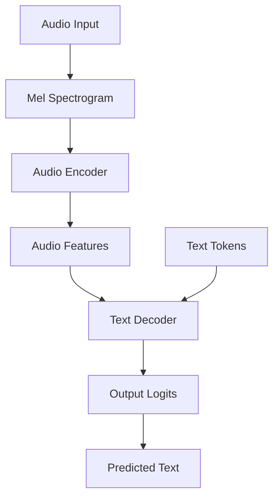

Whisper uses a Transformer-based encoder-decoder architecture optimized for speech recognition tasks. Understanding the architecture helps with model customization, debugging, and advanced use cases.

## Model Dimensions

Each Whisper model is defined by a `ModelDimensions` dataclass that specifies the architecture parameters:

```python whisper/model.py
@dataclass
class ModelDimensions:
    n_mels: int              # Number of mel frequency bins
    n_audio_ctx: int         # Audio context length
    n_audio_state: int       # Audio encoder hidden dimension
    n_audio_head: int        # Number of audio encoder attention heads
    n_audio_layer: int       # Number of audio encoder layers
    n_vocab: int             # Vocabulary size
    n_text_ctx: int          # Text context length
    n_text_state: int        # Text decoder hidden dimension
    n_text_head: int         # Number of text decoder attention heads
    n_text_layer: int        # Number of text decoder layers
```

<Info>
These dimensions are automatically loaded from the model checkpoint and accessible via `model.dims`.
</Info>

## Encoder-Decoder Structure

Whisper consists of two main components:



### Audio Encoder

The `AudioEncoder` processes mel spectrograms into audio features:

```python
class AudioEncoder(nn.Module):
    def __init__(
        self, n_mels: int, n_ctx: int, n_state: int, 
        n_head: int, n_layer: int
    ):
        super().__init__()
        # Two 1D convolution layers
        self.conv1 = Conv1d(n_mels, n_state, kernel_size=3, padding=1)
        self.conv2 = Conv1d(n_state, n_state, kernel_size=3, stride=2, padding=1)
        
        # Sinusoidal positional embeddings
        self.register_buffer("positional_embedding", sinusoids(n_ctx, n_state))
        
        # Transformer blocks
        self.blocks = nn.ModuleList(
            [ResidualAttentionBlock(n_state, n_head) for _ in range(n_layer)]
        )
        self.ln_post = LayerNorm(n_state)
```

#### Encoder Processing Steps

1. **Convolution Layers**: Two 1D convolutions with GELU activation
   - First conv: kernel_size=3, padding=1 (preserves length)
   - Second conv: kernel_size=3, stride=2 (downsamples by 2x)

2. **Positional Encoding**: Sinusoidal embeddings added to features

3. **Transformer Blocks**: Self-attention and feedforward layers

4. **Layer Normalization**: Final normalization layer

<CodeGroup>
```python Encoder Forward Pass
def forward(self, x: Tensor):
    """
    x : torch.Tensor, shape = (batch_size, n_mels, n_ctx)
        the mel spectrogram of the audio
    """
    x = F.gelu(self.conv1(x))
    x = F.gelu(self.conv2(x))
    x = x.permute(0, 2, 1)
    
    assert x.shape[1:] == self.positional_embedding.shape
    x = (x + self.positional_embedding).to(x.dtype)
    
    for block in self.blocks:
        x = block(x)
    
    x = self.ln_post(x)
    return x
```

```python Using Encoder
import whisper

model = whisper.load_model("turbo")
audio = whisper.load_audio("audio.mp3")
audio = whisper.pad_or_trim(audio)
mel = whisper.log_mel_spectrogram(audio, n_mels=model.dims.n_mels)

# Encode audio
audio_features = model.encoder(mel.unsqueeze(0).to(model.device))
print(audio_features.shape)  # (1, n_audio_ctx, n_audio_state)
```
</CodeGroup>

### Text Decoder

The `TextDecoder` generates text tokens autoregressively:

```python
class TextDecoder(nn.Module):
    def __init__(
        self, n_vocab: int, n_ctx: int, n_state: int,
        n_head: int, n_layer: int
    ):
        super().__init__()
        # Token and positional embeddings
        self.token_embedding = nn.Embedding(n_vocab, n_state)
        self.positional_embedding = nn.Parameter(torch.empty(n_ctx, n_state))
        
        # Transformer blocks with cross-attention
        self.blocks = nn.ModuleList([
            ResidualAttentionBlock(n_state, n_head, cross_attention=True)
            for _ in range(n_layer)
        ])
        self.ln = LayerNorm(n_state)
        
        # Causal mask for autoregressive generation
        mask = torch.empty(n_ctx, n_ctx).fill_(-np.inf).triu_(1)
        self.register_buffer("mask", mask, persistent=False)
```

#### Decoder Processing Steps

1. **Token Embeddings**: Convert token IDs to embeddings
2. **Positional Embeddings**: Add position information
3. **Self-Attention**: Attend to previous tokens (causal)
4. **Cross-Attention**: Attend to encoder outputs
5. **Feedforward**: Process through MLP
6. **Output Projection**: Project to vocabulary logits

<CodeGroup>
```python Decoder Forward Pass
def forward(self, x: Tensor, xa: Tensor, kv_cache: Optional[dict] = None):
    """
    x : torch.LongTensor, shape = (batch_size, <= n_ctx)
        the text tokens
    xa : torch.Tensor, shape = (batch_size, n_audio_ctx, n_audio_state)
        the encoded audio features to be attended on
    """
    offset = next(iter(kv_cache.values())).shape[1] if kv_cache else 0
    x = (
        self.token_embedding(x)
        + self.positional_embedding[offset : offset + x.shape[-1]]
    )
    x = x.to(xa.dtype)
    
    for block in self.blocks:
        x = block(x, xa, mask=self.mask, kv_cache=kv_cache)
    
    x = self.ln(x)
    logits = (
        x @ torch.transpose(self.token_embedding.weight.to(x.dtype), 0, 1)
    ).float()
    
    return logits
```

```python Using Decoder
import whisper

model = whisper.load_model("turbo")

# Encode audio
audio = whisper.load_audio("audio.mp3")
mel = whisper.log_mel_spectrogram(audio).unsqueeze(0)
audio_features = model.encoder(mel.to(model.device))

# Decode with initial tokens
initial_tokens = torch.tensor([[50258]]).to(model.device)  # start token
logits = model.decoder(initial_tokens, audio_features)
print(logits.shape)  # (1, 1, n_vocab)
```
</CodeGroup>

## Attention Mechanism

### Multi-Head Attention

Whisper uses standard multi-head attention with optional scaled dot-product attention (SDPA) for efficiency:

```python
class MultiHeadAttention(nn.Module):
    def __init__(self, n_state: int, n_head: int):
        super().__init__()
        self.n_head = n_head
        self.query = Linear(n_state, n_state)
        self.key = Linear(n_state, n_state, bias=False)
        self.value = Linear(n_state, n_state)
        self.out = Linear(n_state, n_state)
```

<AccordionGroup>
  <Accordion title="Self-Attention (Encoder)">
    The encoder uses self-attention where each position attends to all positions in the audio features:
    
    ```python
    # Self-attention in encoder
    q = k = v = audio_features
    attention_output = MultiHeadAttention(q, k, v)
    ```
  </Accordion>
  
  <Accordion title="Causal Self-Attention (Decoder)">
    The decoder uses causal self-attention where each token can only attend to previous tokens:
    
    ```python
    # Causal mask prevents attending to future tokens
    mask = torch.empty(n_ctx, n_ctx).fill_(-np.inf).triu_(1)
    attention_output = MultiHeadAttention(q, k, v, mask=mask)
    ```
  </Accordion>
  
  <Accordion title="Cross-Attention (Decoder)">
    The decoder also uses cross-attention to attend to encoder outputs:
    
    ```python
    # Cross-attention: query from decoder, key/value from encoder
    q = decoder_features
    k = v = encoder_features
    attention_output = MultiHeadAttention(q, k, v)
    ```
  </Accordion>
</AccordionGroup>

### Residual Attention Block

Each transformer layer is a `ResidualAttentionBlock`:

```python
class ResidualAttentionBlock(nn.Module):
    def __init__(self, n_state: int, n_head: int, cross_attention: bool = False):
        super().__init__()
        
        # Self-attention
        self.attn = MultiHeadAttention(n_state, n_head)
        self.attn_ln = LayerNorm(n_state)
        
        # Cross-attention (decoder only)
        self.cross_attn = (
            MultiHeadAttention(n_state, n_head) if cross_attention else None
        )
        self.cross_attn_ln = LayerNorm(n_state) if cross_attention else None
        
        # Feedforward MLP
        n_mlp = n_state * 4
        self.mlp = nn.Sequential(
            Linear(n_state, n_mlp), nn.GELU(), Linear(n_mlp, n_state)
        )
        self.mlp_ln = LayerNorm(n_state)
```

## Positional Encoding

### Sinusoidal Positional Embeddings (Encoder)

The encoder uses fixed sinusoidal positional embeddings:

```python
def sinusoids(length, channels, max_timescale=10000):
    """Returns sinusoids for positional embedding"""
    assert channels % 2 == 0
    log_timescale_increment = np.log(max_timescale) / (channels // 2 - 1)
    inv_timescales = torch.exp(-log_timescale_increment * torch.arange(channels // 2))
    scaled_time = torch.arange(length)[:, np.newaxis] * inv_timescales[np.newaxis, :]
    return torch.cat([torch.sin(scaled_time), torch.cos(scaled_time)], dim=1)
```

### Learned Positional Embeddings (Decoder)

The decoder uses learned positional embeddings:

```python
self.positional_embedding = nn.Parameter(torch.empty(n_ctx, n_state))
```

## Key-Value Caching

Whisper supports KV caching for efficient autoregressive generation:

```python
# Install KV cache hooks
cache, hooks = model.install_kv_cache_hooks()

# Decode with caching (much faster for long sequences)
options = whisper.DecodingOptions()
result = whisper.decode(model, mel, options)

# Remove hooks when done
for hook in hooks:
    hook.remove()
```

<Info>
KV caching stores previously computed key and value tensors, avoiding redundant computation during autoregressive decoding.
</Info>

## Alignment Heads

Whisper uses specific attention heads for word-level timestamp alignment:

```python
# Set alignment heads from model checkpoint
model.set_alignment_heads(alignment_heads_bytes)

# Default: use last half of decoder layers
all_heads = torch.zeros(
    self.dims.n_text_layer, self.dims.n_text_head, dtype=torch.bool
)
all_heads[self.dims.n_text_layer // 2 :] = True
self.register_buffer("alignment_heads", all_heads.to_sparse())
```

## Model Properties

```python
import whisper

model = whisper.load_model("turbo")

# Access model dimensions
print(f"Mel bins: {model.dims.n_mels}")
print(f"Audio context: {model.dims.n_audio_ctx}")
print(f"Audio state: {model.dims.n_audio_state}")
print(f"Text context: {model.dims.n_text_ctx}")
print(f"Vocabulary size: {model.dims.n_vocab}")

# Check model properties
print(f"Is multilingual: {model.is_multilingual}")
print(f"Number of languages: {model.num_languages}")
print(f"Device: {model.device}")
```

## Advanced Usage

### Custom Forward Pass

```python
import whisper
import torch

model = whisper.load_model("turbo")

# Prepare audio
audio = whisper.load_audio("audio.mp3")
mel = whisper.log_mel_spectrogram(audio).unsqueeze(0).to(model.device)

# Manual encoding and decoding
audio_features = model.encoder(mel)
initial_tokens = torch.tensor([[50258, 50259, 50359, 50363]]).to(model.device)
logits = model.decoder(initial_tokens, audio_features)

# Get predictions
predicted_token = logits.argmax(dim=-1)
print(predicted_token)
```

### Accessing Internal Components

```python
# Access encoder
encoder = model.encoder
print(f"Encoder layers: {len(encoder.blocks)}")

# Access decoder
decoder = model.decoder
print(f"Decoder layers: {len(decoder.blocks)}")

# Iterate through attention blocks
for i, block in enumerate(decoder.blocks):
    print(f"Block {i}: {block.attn.n_head} heads")
```

## Performance Optimizations

<CardGroup cols={2}>
  <Card title="Scaled Dot-Product Attention" icon="bolt">
    Uses PyTorch's optimized SDPA when available for faster attention computation.
  </Card>
  
  <Card title="KV Caching" icon="database">
    Caches key and value tensors to avoid redundant computation during generation.
  </Card>
  
  <Card title="Mixed Precision" icon="sliders">
    Supports FP16/BF16 for reduced memory usage and faster inference.
  </Card>
  
  <Card title="Batch Processing" icon="layer-group">
    Can process multiple audio samples in parallel for improved throughput.
  </Card>
</CardGroup>

<Tip>
For production deployments, consider using the `turbo` model with KV caching enabled for optimal speed.
</Tip>
