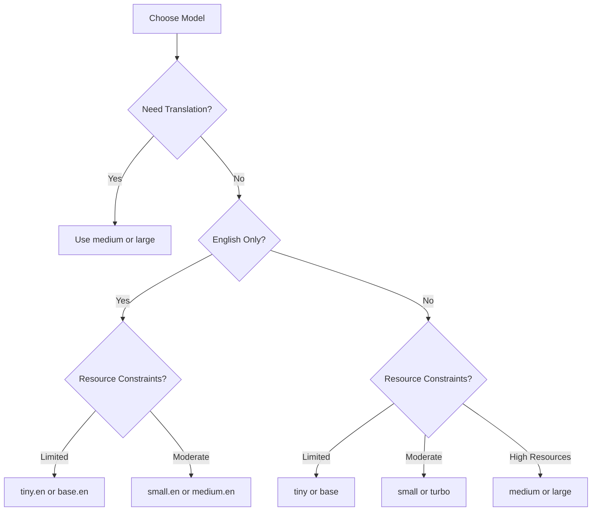

Whisper offers six model sizes with different tradeoffs between speed, accuracy, and resource requirements. Four models have English-only versions optimized for English speech.

## Available Models

<Note>
Relative speeds are measured by transcribing English speech on an A100 GPU. Real-world performance varies based on language, speaking speed, and hardware.
</Note>

### Model Specifications

| Size | Parameters | English-only | Multilingual | Required VRAM | Relative Speed |
|:-----|:-----------|:-------------|:-------------|:--------------|:---------------|
| tiny | 39 M | `tiny.en` | `tiny` | ~1 GB | ~10x |
| base | 74 M | `base.en` | `base` | ~1 GB | ~7x |
| small | 244 M | `small.en` | `small` | ~2 GB | ~4x |
| medium | 769 M | `medium.en` | `medium` | ~5 GB | ~2x |
| large | 1550 M | N/A | `large` | ~10 GB | 1x |
| turbo | 809 M | N/A | `turbo` | ~6 GB | ~8x |

## Model Variants

### Tiny (39M parameters)

<Card>
  **Best for**: Real-time applications with limited resources
  
  - **VRAM**: ~1 GB
  - **Speed**: 10x faster than large
  - **Models**: `tiny.en` (English), `tiny` (Multilingual)
</Card>

```python
model = whisper.load_model("tiny")
# or for English-only
model = whisper.load_model("tiny.en")
```

### Base (74M parameters)

<Card>
  **Best for**: Fast transcription with acceptable accuracy
  
  - **VRAM**: ~1 GB
  - **Speed**: 7x faster than large
  - **Models**: `base.en` (English), `base` (Multilingual)
</Card>

```python
model = whisper.load_model("base")
# or for English-only
model = whisper.load_model("base.en")
```

### Small (244M parameters)

<Card>
  **Best for**: Balanced performance and resource usage
  
  - **VRAM**: ~2 GB
  - **Speed**: 4x faster than large
  - **Models**: `small.en` (English), `small` (Multilingual)
</Card>

```python
model = whisper.load_model("small")
# or for English-only
model = whisper.load_model("small.en")
```

### Medium (769M parameters)

<Card>
  **Best for**: High accuracy with moderate speed
  
  - **VRAM**: ~5 GB
  - **Speed**: 2x faster than large
  - **Models**: `medium.en` (English), `medium` (Multilingual)
</Card>

```python
model = whisper.load_model("medium")
# or for English-only
model = whisper.load_model("medium.en")
```

### Large (1550M parameters)

<Card>
  **Best for**: Maximum accuracy, translation tasks
  
  - **VRAM**: ~10 GB
  - **Speed**: Baseline (1x)
  - **Models**: `large` (Multilingual only)
  - **Versions**: `large-v1`, `large-v2`, `large-v3`
</Card>

```python
model = whisper.load_model("large")
# or specific version
model = whisper.load_model("large-v3")
```

<Note>
The `large` model alias points to `large-v3`, the latest version.
</Note>

### Turbo (809M parameters)

<Card>
  **Best for**: Fast, accurate transcription (default model)
  
  - **VRAM**: ~6 GB
  - **Speed**: 8x faster than large
  - **Models**: `turbo` (Multilingual only)
  - **Based on**: Optimized `large-v3`
</Card>

```python
model = whisper.load_model("turbo")
```

<Warning>
The turbo model is **not trained for translation tasks**. Use `medium` or `large` models for translating speech to English.
</Warning>

## English-only vs Multilingual

### When to Use English-only Models

<AccordionGroup>
  <Accordion title="Better Performance on English">
    The `.en` models perform better on English audio, especially for `tiny.en` and `base.en`. The difference becomes less significant for larger models.
  </Accordion>
  
  <Accordion title="Available Sizes">
    English-only models are available for: tiny, base, small, and medium sizes.
  </Accordion>
</AccordionGroup>

### When to Use Multilingual Models

<Check>
Required for:
- Non-English transcription
- Translation to English
- Language identification
- Multilingual applications
</Check>

## Model Selection Guide



## Loading Models

### Basic Loading

```python
import whisper

model = whisper.load_model("turbo")
```

### With Device Selection

```python
import whisper

# Use specific GPU
model = whisper.load_model("turbo", device="cuda:0")

# Use CPU
model = whisper.load_model("turbo", device="cpu")
```

### Custom Download Location

```python
import whisper

model = whisper.load_model(
    "turbo",
    download_root="/path/to/models"
)
```

### Available Models

```python
import whisper

# Get list of all available models
models = whisper.available_models()
print(models)
# ['tiny.en', 'tiny', 'base.en', 'base', 'small.en', 'small', 
#  'medium.en', 'medium', 'large-v1', 'large-v2', 'large-v3', 
#  'large', 'large-v3-turbo', 'turbo']
```

## Model Versions

The large model has multiple versions with improvements:

- **large-v1**: Original large model
- **large-v2**: Improved accuracy
- **large-v3**: Latest version with best accuracy
- **turbo**: Optimized large-v3 for speed

<Tip>
Use `large` (alias for `large-v3`) or `turbo` for new projects to get the latest improvements.
</Tip>
